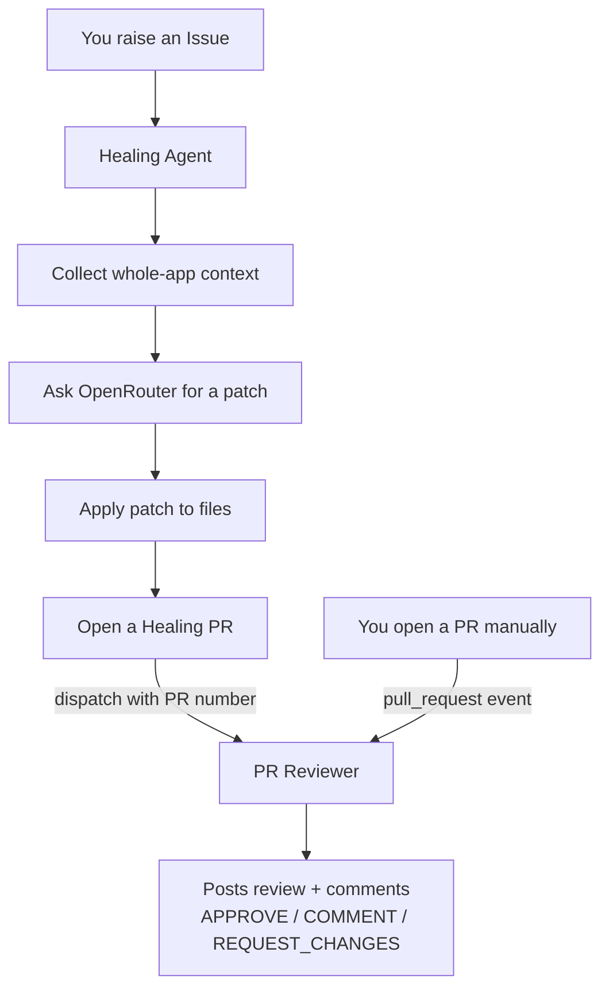

# 🤖 Healing Agent + PR Reviewer — How It Works

This repo has two automated AI workflows that work together:

1. **Healing Agent** — reads a GitHub **issue**, fixes the code, and opens a **pull request**.
2. **PR Reviewer** — reviews **every** pull request (human *and* bot) and writes review comments on your behalf.

Both run on GitHub Actions and use **OpenRouter** (`openrouter/auto`) via the `OPENROUTER_API_KEY` secret.

---

## 1. The end-to-end flow



---

## 2. Healing Agent — `.github/workflows/openrouter-healing-agent.yml`

### When it runs
- Automatically when an **issue** is `opened`, `reopened`, or `edited`.
- Manually via **workflow_dispatch**.

> ⚠️ The `issues` trigger always runs the workflow copy on the **default branch (`main`)**. Edits on feature branches do not take effect until merged to `main`.

### What it does (steps)
1. **Checkout** the repo (full history).
2. **Collect repository context** — the smart part:
   - Extracts **keywords** from the issue, putting **title words first** (so terms like `login` are never dropped).
   - Ranks files by relevance: a file whose **name** matches a keyword (e.g. `login.component.ts`) is weighted heavily; **title** keywords weigh even more.
   - Includes the **full content** of the top ~14 most relevant files (large files capped at 1500 lines).
   - Adds an **EXACT FILE TREE** (up to 600 files) and an **APP STRUCTURE MAP** (every component/service/controller/route) so the model understands the **whole app**, not just one file.
   - Always includes baseline files: routes, app config, global `styles.css`, `package.json`, and the repo Copilot instructions.
3. **Analyze & generate patch** — asks OpenRouter to return a patch using a strict format (see below). The prompt enforces:
   - **Whole-app thinking** (fix can span multiple files).
   - **Responsive UI rules** (must work on mobile ≤480px, tablet ≤768px, desktop >768px; reuse existing breakpoints; never delete media queries).
   - **Partial progress** (do the safe parts rather than giving up).
4. **Extract & apply patch** — a tolerant parser applies the changes and stages them.
5. **Create healing PR** — opens a PR on branch `open_router-healing/issue-<N>` that closes the issue.
6. **Request automated PR review** — explicitly triggers the PR Reviewer on the new PR (see §4 for why this is needed).

### Patch formats the model uses
**Change an existing file:**
```
FILE: Frontend/lunchbox-app/src/app/app.ts
<<<SEARCH
<exact lines copied from the file>
>>>REPLACE
<the new lines>
>>>END
```

**Add a brand-new file (features):**
```
NEWFILE: Frontend/lunchbox-app/src/app/features/foo/foo.component.ts
<<<CONTENT
<full file contents>
>>>END
```

If no safe change is possible, the model returns `NO_PATCH` and the agent posts a comment explaining why — no empty PR is created.

---

## 3. PR Reviewer — `.github/workflows/openrouter-pr-review.yml`

### When it runs
- Automatically on **every PR**: `opened`, `reopened`, `synchronize`, `ready_for_review` (drafts are skipped).
- Via **workflow_dispatch** with a `pr_number` (this is how the healing agent triggers it for bot PRs).

### What it does
1. Reads the PR's **changed files and diff** via the GitHub API (skips `node_modules`, `dist`, `bin`, `obj`, lock files, `.min.*`, `.map`). Diff capped at 200k chars.
2. Asks OpenRouter to review for:
   - **Summary** of the change
   - **Correctness & bugs**
   - **Security** (OWASP Top 10)
   - **UI / responsiveness** on desktop + mobile
   - **Maintainability**
   - **Tests & validation**
3. Posts a **PR review** with a verdict:
   - `APPROVE` — no blocking issues
   - `REQUEST_CHANGES` — bugs, security, or broken UI
   - `COMMENT` — minor/non-blocking notes
4. **Self-PR fallback:** GitHub won't let a token `APPROVE`/`REQUEST_CHANGES` its own PR, so if that's rejected it falls back to posting a normal comment.

---

## 4. Why the healing agent must "dispatch" the reviewer

GitHub has an anti-recursion rule: **PRs created with the built-in `GITHUB_TOKEN` do not trigger other workflows** (like the reviewer).

- **Human PRs** → fire the normal `pull_request` event → reviewer runs automatically. ✅
- **Bot (healing) PRs** → would be silently ignored. ❌

To fix this, the healing agent has an extra step that **explicitly dispatches** the reviewer with the new PR number, so **every** PR — human or bot — gets reviewed and commented on.

This requires `actions: write` permission in the healing workflow (already added).

---

## 5. Setup / requirements

| Requirement | Notes |
|---|---|
| `OPENROUTER_API_KEY` secret | Repo → Settings → Secrets and variables → Actions. Used by both workflows. |
| Both workflow files on **`main`** | `pull_request` runs the base-branch copy, and dispatch requires the reviewer to exist on the default branch. |
| `OPENROUTER_API_BASE_URL` variable | Optional; defaults to `https://openrouter.ai/api/v1`. |

> 🔒 **Forked PRs:** GitHub makes `GITHUB_TOKEN` read-only for PRs from forks, so the reviewer can't post on those. It works fully for branches inside this repo.

---

## 6. How to raise an issue the agent can fix

The agent finds files from your **wording**, so write issues like this:

1. **Put the key terms in the title** — the screen/component/file name + the action.
   - ✅ `Simplify login screen by removing admin roles`
   - ❌ `UI is cluttered`
2. **Name the screen/component literally** (`login screen`, `order service`) — matching real file/folder names.
3. **Say exactly what to change** — `Remove the Admin, Fleet Owner, and Support Exec buttons`.
4. **Quote on-screen text/labels** so the agent can grep for the real code.
5. **Keep it to one module / one change** — one issue → one branch → one PR.
6. **Use action verbs** — add, remove, rename, fix, hide, replace, redirect.
7. **Avoid pure architecture asks** (e.g. "create a new subdomain") — the agent will do the achievable code parts and note what it skipped.

**Template:**
```
Title: <Action> <component/screen name> — <short what>

## What
Remove the Admin, Fleet Owner, and Support Exec buttons from the login screen.

## Where
Frontend/lunchbox-app — login component (mode selector).

## Expected
Only Customer/Rider and Driver options remain visible.
```

---

## 7. Honest limitations

- The model can only patch files it can **see** in the collected context. The ranking ensures the issue's own files are included, but a very large repo may trim the least-relevant files.
- AI output varies — occasionally a well-scoped issue may still return `NO_PATCH`. Re-running (edit/reopen the issue) usually helps.
- Reviews and patches are **advisory**. A human should confirm before merging.

---

## 8. Files involved

| File | Role |
|---|---|
| `.github/workflows/openrouter-healing-agent.yml` | Issue → patch → PR (active) |
| `.github/workflows/openrouter-pr-review.yml` | Reviews every PR, posts comments |
| `.github/workflows/openai-healing-agent.yml` | Disabled (`if: false`) |
| `.github/workflows/grok-healing-agent.yml` | Disabled (`if: false`) |
| `.github/copilot-instructions.md` | Repo rules the agent follows |
| `healing-reports/` | Generated analysis + context per issue |
