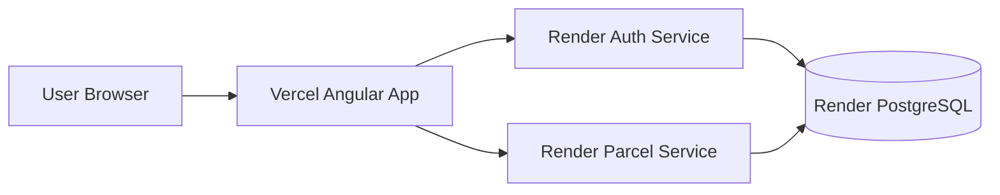

# LunchBox Full Hosting Guide (Render + Vercel + Database)

This guide is prepared for your current project structure:
- Backend: .NET minimal APIs in `Backend/dotnet/AuthService` and `Backend/dotnet/ParcelService`
- Frontend: Angular app in `Frontend/lunchbox-app`
- Hosting target:
  - Frontend on Vercel
  - Backend services on Render
  - Database on Render PostgreSQL

---

## 1) Final architecture (production)

- Vercel: serves Angular static build
- Render Web Service 1: Auth API
- Render Web Service 2: Parcel API
- Render PostgreSQL: shared database (recommended) or one DB per service



---

## 2) Required code changes before hosting

You already fixed:
- `Backend/dotnet/LunchBox.slnx` project paths
- `Frontend/lunchbox-app/tsconfig.app.json` rootDir for TS6

Now apply the production hosting changes below.

---

## 3) Backend changes (AuthService + ParcelService)

## 3.1 Add PostgreSQL provider package

Run these commands:

```powershell
Push-Location "c:\Ekart\Backend\dotnet\AuthService"
dotnet add package Npgsql.EntityFrameworkCore.PostgreSQL
Pop-Location

Push-Location "c:\Ekart\Backend\dotnet\ParcelService"
dotnet add package Npgsql.EntityFrameworkCore.PostgreSQL
Pop-Location
```

## 3.2 Update CORS + DB in AuthService

File: `Backend/dotnet/AuthService/Program.cs`

### Replace this block

```csharp
builder.Services.AddCors(options =>
{
    options.AddDefaultPolicy(policy =>
    {
        policy.AllowAnyOrigin()
            .AllowAnyHeader()
            .AllowAnyMethod();
    });
});
builder.Services.AddDbContext<AuthDbContext>(options =>
    options.UseSqlite($"Data Source={Path.Combine(builder.Environment.ContentRootPath, "auth.db")}"));
```

### With this

```csharp
var frontendOrigin = builder.Configuration["FrontendOrigin"];

builder.Services.AddCors(options =>
{
    options.AddDefaultPolicy(policy =>
    {
        if (!string.IsNullOrWhiteSpace(frontendOrigin))
        {
            policy.WithOrigins(frontendOrigin)
                .AllowAnyHeader()
                .AllowAnyMethod();
        }
        else
        {
            policy.AllowAnyOrigin()
                .AllowAnyHeader()
                .AllowAnyMethod();
        }
    });
});

var authDbConnection = builder.Configuration.GetConnectionString("AuthDb")
                      ?? builder.Configuration["DATABASE_URL"];

if (!string.IsNullOrWhiteSpace(authDbConnection))
{
    builder.Services.AddDbContext<AuthDbContext>(options => options.UseNpgsql(authDbConnection));
}
else
{
    builder.Services.AddDbContext<AuthDbContext>(options =>
        options.UseSqlite($"Data Source={Path.Combine(builder.Environment.ContentRootPath, "auth.db")}"));
}
```

## 3.3 Update CORS + DB in ParcelService

File: `Backend/dotnet/ParcelService/Program.cs`

### Replace this block

```csharp
builder.Services.AddCors(options =>
{
	options.AddDefaultPolicy(policy =>
	{
		policy.AllowAnyOrigin()
			.AllowAnyHeader()
			.AllowAnyMethod();
	});
});
builder.Services.AddDbContext<ParcelDbContext>(options =>
	options.UseSqlite($"Data Source={Path.Combine(builder.Environment.ContentRootPath, "parcel.db")}"));
```

### With this

```csharp
var frontendOrigin = builder.Configuration["FrontendOrigin"];

builder.Services.AddCors(options =>
{
    options.AddDefaultPolicy(policy =>
    {
        if (!string.IsNullOrWhiteSpace(frontendOrigin))
        {
            policy.WithOrigins(frontendOrigin)
                .AllowAnyHeader()
                .AllowAnyMethod();
        }
        else
        {
            policy.AllowAnyOrigin()
                .AllowAnyHeader()
                .AllowAnyMethod();
        }
    });
});

var parcelDbConnection = builder.Configuration.GetConnectionString("ParcelDb")
                        ?? builder.Configuration["DATABASE_URL"];

if (!string.IsNullOrWhiteSpace(parcelDbConnection))
{
    builder.Services.AddDbContext<ParcelDbContext>(options => options.UseNpgsql(parcelDbConnection));
}
else
{
    builder.Services.AddDbContext<ParcelDbContext>(options =>
        options.UseSqlite($"Data Source={Path.Combine(builder.Environment.ContentRootPath, "parcel.db")}"));
}
```

## 3.4 Add appsettings connection keys (optional but clean)

File: `Backend/dotnet/AuthService/appsettings.json`

```json
{
  "ConnectionStrings": {
    "AuthDb": ""
  },
  "FrontendOrigin": ""
}
```

File: `Backend/dotnet/ParcelService/appsettings.json`

```json
{
  "ConnectionStrings": {
    "ParcelDb": ""
  },
  "FrontendOrigin": ""
}
```

Note:
- In Render, set env vars. Do not commit real DB credentials.

---

## 4) Frontend changes (remove hardcoded API URLs)

You currently have hardcoded URLs in multiple files. Replace with Angular environment config.

## 4.1 Create environment files

Create file: `Frontend/lunchbox-app/src/environments/environment.ts`

```ts
export const environment = {
  production: false,
  authApiBase: 'http://localhost:3003',
  parcelApiBase: 'http://localhost:3004',
  gatewayApiBase: 'http://localhost:3003'
};
```

Create file: `Frontend/lunchbox-app/src/environments/environment.prod.ts`

```ts
export const environment = {
  production: true,
  authApiBase: 'https://YOUR_AUTH_RENDER_URL.onrender.com',
  parcelApiBase: 'https://YOUR_PARCEL_RENDER_URL.onrender.com',
  gatewayApiBase: 'https://YOUR_GATEWAY_RENDER_URL.onrender.com'
};
```

## 4.2 Auth service small-line changes

File: `Frontend/lunchbox-app/src/app/core/services/auth.service.ts`

### Remove these lines

```ts
const IS_LOCAL_FRONTEND = typeof window !== 'undefined' && ['localhost', '127.0.0.1'].includes(window.location.hostname);
const AUTH_API_BASE = IS_LOCAL_FRONTEND ? 'http://localhost:3003' : 'https://lunchbox-auth-service.onrender.com';
```

### Add import and replace base

```ts
import { environment } from '../../../environments/environment';
const AUTH_API_BASE = environment.authApiBase;
```

## 4.3 Booking service small-line changes

File: `Frontend/lunchbox-app/src/app/core/services/booking.service.ts`

### Replace this

```ts
const IS_LOCAL_FRONTEND = typeof window !== 'undefined' && ['localhost', '127.0.0.1'].includes(window.location.hostname);
const BOOKINGS_API = IS_LOCAL_FRONTEND
  ? 'http://localhost:3003/api/bookings'
  : 'https://lunchbox-auth-service.onrender.com/api/bookings';
```

### With this

```ts
import { environment } from '../../../environments/environment';
const BOOKINGS_API = `${environment.parcelApiBase}/api/bookings`;
```

## 4.4 Pricing service small-line changes

File: `Frontend/lunchbox-app/src/app/core/services/pricing.service.ts`

### Replace pricingApi initializer with

```ts
private readonly pricingApi = `${environment.authApiBase}/api/pricing`;
```

Also add:

```ts
import { environment } from '../../../environments/environment';
```

## 4.5 Integration health service small-line changes

File: `Frontend/lunchbox-app/src/app/core/services/integration-health.service.ts`

### Replace integrationApi initializer with

```ts
private readonly integrationApi = `${environment.authApiBase}/api/integrations`;
```

Also add:

```ts
import { environment } from '../../../environments/environment';
```

## 4.6 Order and user service small-line changes

File: `Frontend/lunchbox-app/src/app/services/order.service.ts`

```ts
import { environment } from '../../environments/environment';
private apiUrl = `${environment.gatewayApiBase}/api/orders`;
```

File: `Frontend/lunchbox-app/src/app/services/user.service.ts`

```ts
import { environment } from '../../environments/environment';
private apiUrl = `${environment.gatewayApiBase}/api/users`;
```

## 4.7 Add Vercel SPA rewrite config

Create file: `Frontend/lunchbox-app/vercel.json`

```json
{
  "rewrites": [
    { "source": "/(.*)", "destination": "/index.html" }
  ]
}
```

---

## 5) Render database setup (step by step)

1. Open Render dashboard.
2. Click New -> PostgreSQL.
3. Name: `lunchbox-db`.
4. Plan: choose plan as per budget.
5. Region: same region as your backend services.
6. Create database.
7. Copy the Internal Database URL.

Use this URL as:
- `ConnectionStrings__AuthDb` in Auth service
- `ConnectionStrings__ParcelDb` in Parcel service

---

## 6) Deploy AuthService on Render

1. New -> Web Service.
2. Connect your GitHub repo.
3. Root directory: `Backend/dotnet/AuthService`
4. Environment: Docker not required (Native).
5. Build command:

```bash
dotnet restore && dotnet publish -c Release -o out
```

6. Start command:

```bash
dotnet out/AuthService.dll
```

7. Add environment variables:
- `ASPNETCORE_URLS` = `http://0.0.0.0:$PORT`
- `ConnectionStrings__AuthDb` = Render Postgres internal URL
- `FrontendOrigin` = your Vercel domain (for example https://your-app.vercel.app)

8. Deploy service.
9. Verify `GET /` and `GET /api/auth/demo-user`.

---

## 7) Deploy ParcelService on Render

1. New -> Web Service.
2. Root directory: `Backend/dotnet/ParcelService`
3. Build command:

```bash
dotnet restore && dotnet publish -c Release -o out
```

4. Start command:

```bash
dotnet out/ParcelService.dll
```

5. Environment variables:
- `ASPNETCORE_URLS` = `http://0.0.0.0:$PORT`
- `ConnectionStrings__ParcelDb` = Render Postgres internal URL
- `FrontendOrigin` = your Vercel domain

6. Deploy service.
7. Verify `GET /` and `GET /api/catalog`.

---

## 8) Deploy Angular frontend on Vercel

1. Import project in Vercel.
2. Root directory: `Frontend/lunchbox-app`
3. Framework preset: Angular
4. Build command:

```bash
npm run build
```

5. Output directory:

```text
dist/lunchbox-app
```

6. Environment variables (if needed later):
- Prefer values in `environment.prod.ts` for now.

7. Deploy.
8. Open domain and test full user flow.

---

## 9) Post-deploy smoke test checklist

1. Open frontend URL.
2. Login flow works (no CORS error in browser console).
3. Demo user endpoint returns 200.
4. Create booking returns 201/200.
5. Verify booking tracking endpoint returns live data.
6. Refresh page and verify data persists from backend DB.

---

## 10) Screenshot checklist (attach these during deployment)

I cannot capture screenshots from your private Render/Vercel account automatically, so use this checklist and save each screenshot with the exact filename below.

1. `screenshots/01-render-create-postgres.png`
   - Render -> New PostgreSQL page filled
2. `screenshots/02-render-postgres-created.png`
   - Postgres dashboard with Internal DB URL visible (mask secrets)
3. `screenshots/03-render-auth-settings.png`
   - Auth service settings with Root Dir, Build, Start commands
4. `screenshots/04-render-auth-env-vars.png`
   - Auth env vars (`ASPNETCORE_URLS`, `ConnectionStrings__AuthDb`, `FrontendOrigin`)
5. `screenshots/05-render-auth-deploy-success.png`
   - Auth service deploy logs success
6. `screenshots/06-render-parcel-settings.png`
   - Parcel service settings page
7. `screenshots/07-render-parcel-env-vars.png`
   - Parcel env vars page
8. `screenshots/08-render-parcel-deploy-success.png`
   - Parcel deploy logs success
9. `screenshots/09-vercel-project-settings.png`
   - Vercel project root/build/output settings
10. `screenshots/10-vercel-deploy-success.png`
    - Successful deployment page
11. `screenshots/11-browser-network-auth-200.png`
    - Browser DevTools network: auth call 200
12. `screenshots/12-browser-network-booking-200.png`
    - Browser DevTools network: booking call 200

---

## 11) One-command local verification before pushing

```powershell
Push-Location "c:\Ekart\Backend\dotnet"
dotnet build .\LunchBox.slnx -c Release
Pop-Location

Push-Location "c:\Ekart\Frontend\lunchbox-app"
npm run build
Pop-Location
```

If both pass, deployment is ready.

---

## 12) Common issues and exact fix

1. Issue: CORS blocked in browser
- Fix: Render env var `FrontendOrigin` must be exact Vercel URL (including https)

2. Issue: 500 DB connection errors
- Fix: Ensure `ConnectionStrings__AuthDb` and `ConnectionStrings__ParcelDb` are set with correct Render internal URL

3. Issue: Angular routes 404 on refresh
- Fix: ensure `vercel.json` rewrite is present in `Frontend/lunchbox-app/vercel.json`

4. Issue: Render service not listening
- Fix: set `ASPNETCORE_URLS=http://0.0.0.0:$PORT`

---

Deployment note:
- Keep production secrets only in Render/Vercel environment variables.
- Do not commit real credentials in Git.
